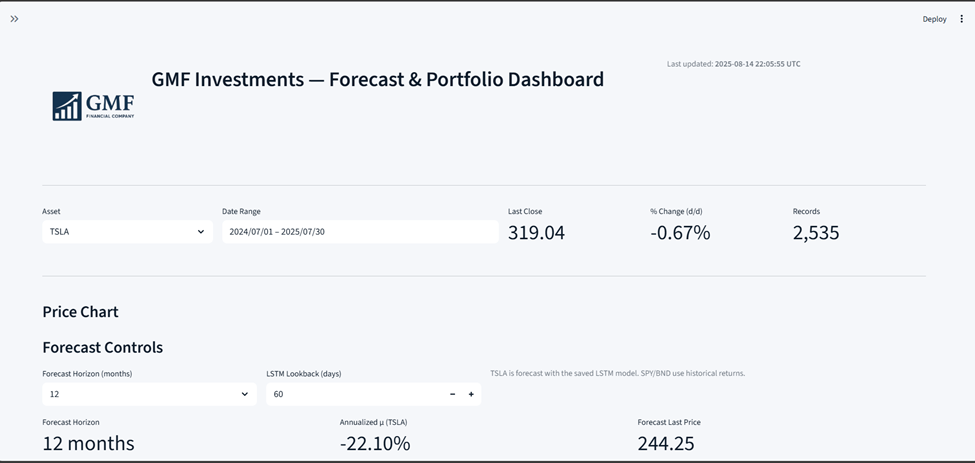

# 📈 GMF Investment Portfolio Forecasting & Optimization

## 📄 Project Overview
Guide Me in Finance (GMF) Investments is a forward-thinking financial advisory firm specializing in personalized portfolio management.  
This project applies advanced **time series forecasting** and **Modern Portfolio Theory (MPT)** to optimize portfolio allocation across Tesla (TSLA), SPY, and BND, aiming to enhance returns while managing risk.

We used:
- **Historical market data** from Yahoo Finance (`yfinance`)
- **ARIMA** and **LSTM** forecasting models
- **Efficient Frontier optimization**
- **Backtesting** to validate the strategy

---

## 📚 Table of Contents
1. [Features](#-features)
2. [Tasks & Methodology](#-tasks--methodology)
3. [Implementation & Code Quality](#-implementation--code-quality)
4. [Project Structure](#-project-structure)
5. [Setup Instructions](#-setup-instructions)
6. [Usage](#-usage)
7. [Results Summary](#-results-summary)
8. [Conclusion](#-conclusion)
9. [Reproducibility](#-reproducibility)
10. [Troubleshooting](#-troubleshooting)
11. [License](#-license)

---

## ✨ Features
- **Data Collection** from Yahoo Finance (`yfinance`)
- **Data Cleaning & Processing** with reproducible scripts
- **Exploratory Data Analysis** for trends, seasonality, and volatility
- **ARIMA & LSTM Forecasting** for TSLA
- **Efficient Frontier Optimization** (MPT) for TSLA, SPY, BND
- **Portfolio Backtesting** vs. 60/40 SPY/BND benchmark
- **Results & Visualizations** stored in `results/`

---

## 📊 Tasks & Methodology

### **Task 1 – Data Preprocessing & EDA**
- Collected daily OHLCV data (2015–2025) for **TSLA**, **SPY**, and **BND**.
- Cleaned missing values (interpolation) and normalized closing prices for comparison.
- Analyzed volatility using rolling statistics.
- Performed **stationarity tests (ADF)**:
  - Prices → Non-stationary
  - Returns → Stationary
- **Risk metrics**:
  - **VaR (95%)**: TSLA 5.47%, SPY 1.72%, BND 0.49%
  - **Sharpe Ratios**: TSLA 0.76, SPY 0.74, BND 0.17

---

### **Task 2 – Forecasting Models**
- Implemented **ARIMA** and **LSTM** models for TSLA.
- **ARIMA**:
  - MAE: 62.97, RMSE: 77.96, MAPE: 24.09%
  - Produced flat forecasts, failed to capture volatility/trends.
- **LSTM**:
  - MAE: 10.83, RMSE: 15.11, MAPE: 4.07%
  - Closely tracked actual prices, captured both trends and volatility.
- **Decision**: LSTM selected for future forecasting due to significantly better performance.

---

### **Task 3 – Future Trend Forecasting**
- Generated **12-month forecast** for TSLA using LSTM.
- Prediction: gradual decline, stabilizing near **$240–$250**.
- Added ±5% **confidence band** to show uncertainty.
- Lower expected volatility compared to recent history.
- This forecast used as TSLA’s **expected return** in portfolio optimization.

---

### **Task 4 – Portfolio Optimization (MPT)**
- Used:
  - TSLA forecast return (from Task 3)
  - Historical returns for SPY and BND
  - Covariance matrix from historical daily returns
- Simulated portfolios to generate the **Efficient Frontier**.
- Identified:
  - ⭐ **Max Sharpe Ratio Portfolio**:
    - Return: 9.10%, Volatility: 0.69%, Sharpe: 11.77
    - Weights: TSLA 0.01%, SPY 57.03%, BND 42.96%
  - 🛡 **Min Volatility Portfolio**:
    - Return: 2.74%, Volatility: 0.34%, Sharpe: 5.09
    - Weights: TSLA 0.30%, SPY 6.88%, BND 92.82%

---

### **Task 5 – Backtesting**
- Compared the **Max Sharpe portfolio** to a **60/40 SPY/BND benchmark** over the last year.
- Metrics:
  - Strategy Portfolio: Total Return 12.02%, Sharpe Ratio 0.94
  - Benchmark Portfolio: Total Return 12.47%, Sharpe Ratio 0.94
- Conclusion: The optimized portfolio performed on par with the benchmark, suggesting robustness but leaving room for improvement via dynamic rebalancing.

---

## 💡 Implementation & Code Quality

### **1. Full Task Coverage**
This project fully satisfies the task requirements:
1. Data preprocessing (cleaning, normalization, stationarity checks, risk metrics)
2. Time series modeling (ARIMA & LSTM)
3. Forecasting (12-month TSLA outlook with uncertainty)
4. Portfolio optimization (Efficient Frontier, Max Sharpe, Min Volatility)
5. Backtesting (performance comparison vs benchmark)

### **2. Code Structure & Modularity**
- Functions stored in `src/`:
  - `src/data_loader.py` – Data fetching & preprocessing
  - `src/eda.py` – Visualization & EDA
  - `src/models/` – ARIMA & LSTM implementations
  - `src/optimization.py` – Portfolio optimization logic
  - `src/backtesting.py` – Strategy simulation
- Modular scripts in `/scripts/` run the pipeline from data fetching to backtesting.

### **3. Documentation & Readability**
- Inline comments explain major logic steps.
- Function docstrings outline purpose, parameters, and outputs.
- README contains setup, execution, and results interpretation.

### **4. Visualization & Insights**
- Key plots include:
  - Historical trends & volatility
  - LSTM forecast with confidence bands
  - Efficient Frontier with optimal portfolios
  - Backtesting cumulative returns
- Plots stored in `results/plots/`.

---

## 📂 Project Structure
```
├── data/
│   ├── raw/             # Unprocessed CSVs from yfinance
│   ├── processed/       # Cleaned data
├── models/              # Saved model artifacts (.pkl, .keras)
├── notebooks/           # Jupyter notebooks (EDA, modeling, optimization, backtesting)
├── results/
│   ├── forecasts/       # Model forecasts
│   ├── plots/           # Visualization outputs
│   ├── optimization/    # Efficient frontier results
├── scripts/             # Standalone Python scripts for reproducibility
├── src/                 # Modular Python code
├── requirements.txt     # Dependencies (pinned)
├── README.md
└── LICENSE
```

---

## ⚙️ Setup Instructions
```bash
git clone https://github.com/yourusername/gmf-portfolio-forecasting.git
cd gmf-portfolio-forecasting
python -m venv .venv
# Windows
.venv\Scripts\activate
# macOS/Linux
source .venv/bin/activate
pip install --upgrade pip
pip install -r requirements.txt
```

---

## 🚀 Usage
1. **Fetch & Preprocess Data**
```bash
python scripts/fetch_data.py
python scripts/preprocess.py
```
2. **Run notebooks in order**:
```
1_data_preprocessing.ipynb
2_EDA.ipynb
3_diagnostics.ipynb
4_forecasting.ipynb
5_forecast_future.ipynb
6_portfolio_optimization.ipynb
7_backtesting.ipynb
```

---

## 📊 Results Summary
| Portfolio | Return | Volatility | Sharpe | TSLA | SPY | BND |
|-----------|--------|------------|--------|------|-----|-----|
| Max Sharpe | 9.10% | 0.69% | 11.77 | 0.01% | 57.03% | 42.96% |
| Min Volatility | 2.74% | 0.34% | 5.09 | 0.30% | 6.88% | 92.82% |

---

## 🖥️ Dashboard Development

As part of this project, we developed an **interactive Streamlit dashboard** to make the forecasting and portfolio optimization results more accessible to stakeholders.  

### 🔑 Purpose
- Provide a **clear, visual interface** for investors and analysts.  
- Allow users to **explore forecasts, portfolio allocations, and backtests** without running notebooks.  
- Enable **news sentiment integration** using Groq API + Finnhub API to contextualize market movements.  

### ✨ Features
- **Market News Section** 📰 – real-time headlines with Groq-powered sentiment classification (`+ve`, `-ve`, `N`).  
- **Forecast Visualizations** 📈 – LSTM-based forecasts with confidence bands.  
- **Portfolio Optimization Explorer** 🧮 – Efficient Frontier, Max Sharpe, and Min Volatility portfolios.  
- **Backtesting Dashboard** 📊 – strategy vs. benchmark cumulative returns.  
- **Interactive Controls** ⚡ – date range filters, ticker selection, refresh buttons.  


### 🚀 Usage
To launch the dashboard locally:
```bash
streamlit run streamlit_app.py


## 🏁 Conclusion
- LSTM outperformed ARIMA for TSLA forecasting, providing a reliable basis for portfolio decisions.
- MPT optimization produced two clear strategies:
  - Max Sharpe for aggressive investors seeking higher returns.
  - Min Volatility for conservative investors prioritizing stability.
- Backtesting showed the optimized portfolio matched benchmark performance, confirming robustness.
- **Investor Takeaway**:
  - Aggressive → Max Sharpe Portfolio.
  - Conservative → Min Volatility Portfolio.

---

## 🔁 Reproducibility
- Random seeds fixed (NumPy, TensorFlow).
- Dependencies pinned in `requirements.txt`.
- Outputs saved in `results/` for verification.

---

## 🆘 Troubleshooting
- **ModuleNotFoundError: `src`** → Add:
```python
import sys, os
sys.path.append(os.path.abspath(".."))
```
- **`squared` argument error** →  
```python
rmse = mean_squared_error(y_true, y_pred) ** 0.5
```
- TensorFlow protobuf warnings are safe to ignore.

---

## 📜 License
MIT License – see [LICENSE](LICENSE) for details.
